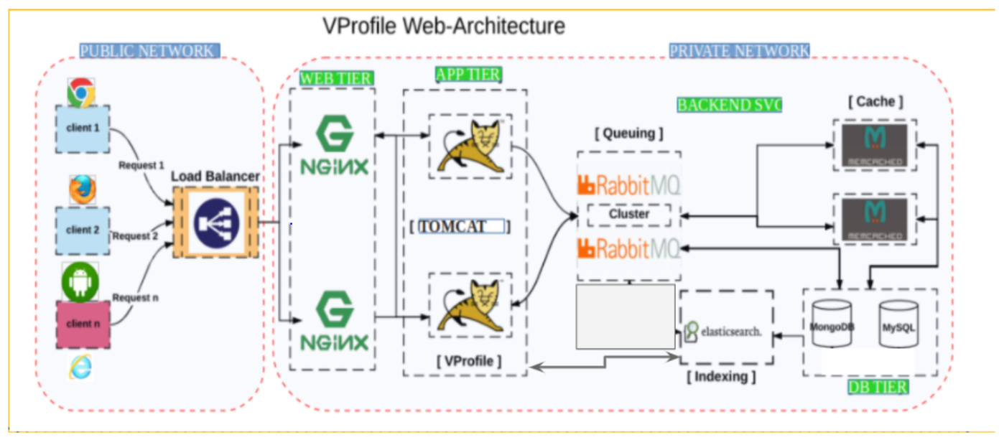

## MultiTier web application Setup locally
---
#### Prerequisites
- JDK 1.8 or later
- Maven 3 or later
- MySQL 5.6 or later

#### Technologies
- Spring MVC
- Spring Security
- Spring Data JPA
- Maven
- JSP
- MySQL

### Application Architecture:
---


#### Automataion tools Includes: 
---
- Vagrant
- VirtualBox
- TomCat
- Bash Script
- MySql
- Nginx
- MemCache

### Manual Process:
---
- Raise necessary instances
```
vagrant up
```
- Follow below doc

[Click here for the pdf](.\vagrant\manual_process\VprofileProjectSetup.pdf)

### Automatic Process:
---
```
vagrant up
```